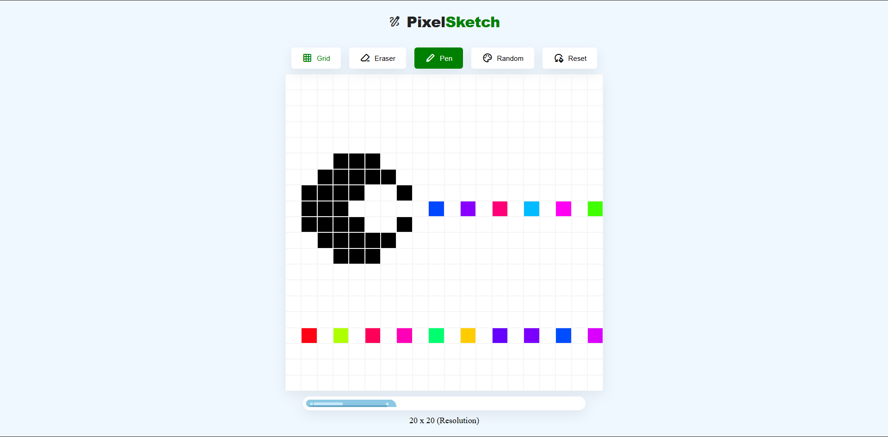

# Pixel Sketch

A lightweight, interactive browser-based drawing application built with vanilla HTML, CSS, and JavaScript.

## Features
- **Dynamic Grid Sizing:** Adjustable grid resolution via range slider.
- **Drawing Modes:** Classic Pen, Rainbow Mode (random color generation), and Eraser.
- **Canvas Controls:** Toggle grid borders on/off and clear the canvas instantly.
- **Performance Optimized:** Built with event delegation and drag-prevention for smooth drawing.

## Tech Stack
- HTML5
- CSS3 (Flexbox & CSS Variables)
- Vanilla JavaScript (DOM Manipulation & Event Handling)

## Live Demo
[Try the App on Vercel](https://pixel-sketch-pi.vercel.app)